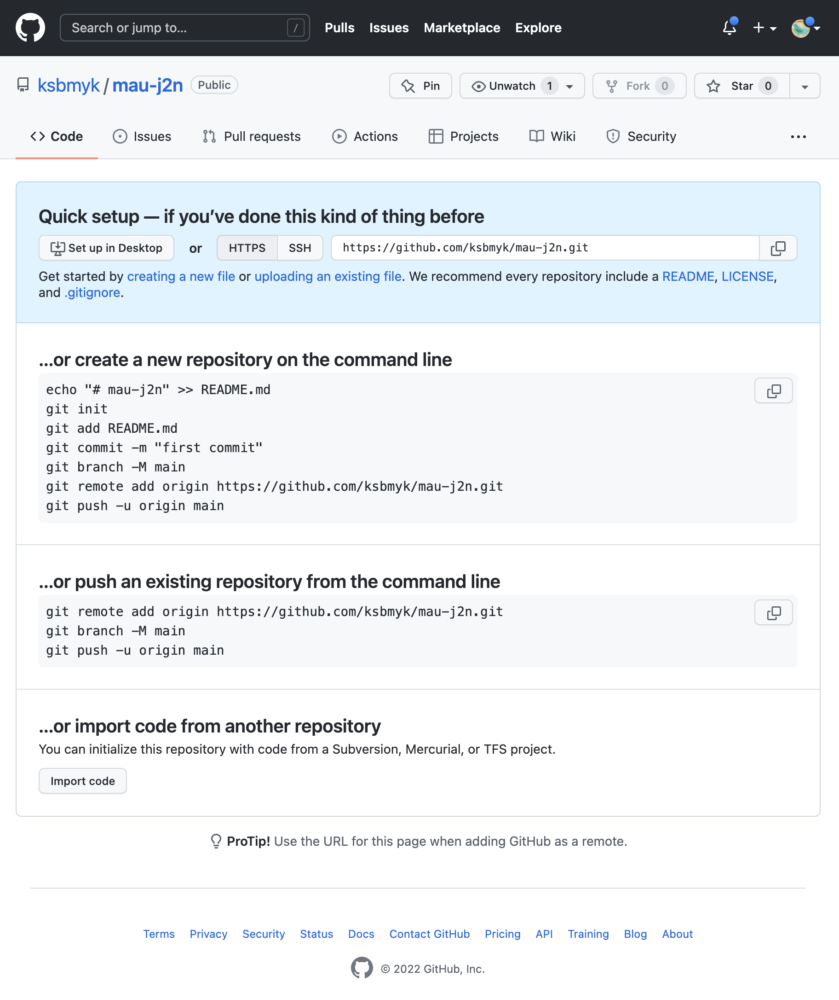

# gitとは
Gitとは分散型バージョン管理システムである。
バージョン管理とは、一つのファイルやファイルの集合に対しての変更を記録するシステムである。
記録すると、過去の変更履歴の比較や、最後に修正された時期の確認などできるため、問題が起きた場合に調査がしやすかったり、特定バージョンを呼び出すことができるので、もしも以前の状態に戻したかったり、ファイルを失ったりしても、その状態が簡単に復元できる点が便利である。
また、Gitを使って複数の開発者と共同開発を行うこともできる。開発者一人一人が自分のGitをもち、他の開発者のGitとの間でコードの変更をやりとりする分散型の仕組みになっている。
Gitではクライアントはレポジトリ（バージョン管理の対象になるファイル、ディレクトリ、更新履歴などの一群）全体を複製するため、あるサーバーが故障して、DVCSがそのサーバーを介して連携していたとしても、クライアント・レポジトリの一つをサーバーにコピーすれば修復できる。
また、全複製を保持しているため、レポジトリにアクセスできない状態でも、履歴の調査や変更の記録といったことが可能になる。

# GitHubとは

GitHubはGitレポジトリのホスティングサービスである。
GitHubのGitをメインのGitとして開発者たちが自分のGitとGitHubのGitの間で変更のやりとりをする仕組みでバージョン管理が行える。
GitHubではバージョン管理だけでなく、本体への反映を他の開発者に依頼する「Pull Request」機能を提供している。これは、コードなどを追加・修正した際本体への反映を他の開発者に依頼する機能で、反映を行う前にレビューを行うワークフローを実現しやすく、品質を向上することができる。レビューコメントや議論をコードの変更内容とともに保管でき、あとで参照できるため経緯を確認しやすくなっている。
レポジトリへのアクセス制限を行うこともでき、許可されたユーザだけがアクセスできるよう制限しつつ、必要な人同士は連携することができる。
また、ブラウザ上で更新の差分をわかりやすく視覚化、更新の履歴もタイムラインスタイルのインターフェースで見ることができる。操作自体もブラウザからも可能なためGitに不慣れな人でも利用しやすい。

# Markdownとは
Markdownはマークアップ言語である。Markdownを使用すると、読みやすく書きやすいプレーンテキスト形式を使用して記述し、それを構造的に有効な別のマークアップ言語であるHTMLに変換できる。
コンバーターがあればパワーポイントやLaTeXなど、HTML以外のファイル形式に変換することもできる
Markdownの便利な点は、手軽に文章構造(見出し、段落、強調、箇条書きといった文章の構造)を明示でき、その記述方が簡単で覚えやすい点である。
例えば見出しは行頭に#をつける(#の数を増やすと中見出し、小見出しとなる)。段落は 空行で一行空ける 強調したい文字は**で囲む。箇条書きは行頭に `-` をつけるといったルールである。
Markdown自身は限られた記法しかないため、様々な拡張記法(方言)がある。例えばGitHubで採用されているGitHub Flavored Markdown は、`~~文字列~~` で打ち消し線~~文字列~~、リンク形式の文字列を`[文字列](URL)` と記述しなくても自動的にリンクにする https://github.co.jp 等がある。

# gitの準備
2022/04/07実施
## 前準備
-  作業PCにgitが入っているかを確認
  - `$ git --version`
    - Xcodeのインストールを求められた
```
$ git --version
xcode-select: note: no developer tools were found at '/Applications/Xcode.app', requesting install. Choose an option in the dialog to download the command line developer tools.
```

- Homebrewのインストール
Gitの[公式サイト](http://git-scm.com/download/mac)にあったHomebrewを使ったgitを管理したかったのでまずはHomebrewをインストールする（XCodeもHowmebrewインストールのときに合わせて入る）
  - brewが入っていないことを為確認
```
$ brew --version
zsh: command not found: brew
```
- brewをインストールする
  - 参照: https://brew.sh/index_ja
```
$ /bin/bash -c "$(curl -fsSL https://raw.githubusercontent.com/Homebrew/install/HEAD/install.sh)"
==> Checking for `sudo` access (which may request your password)...
Password:
==> This script will install:
/usr/local/bin/brew
…（略）…
```
<details>
<summary>全ログ</summary>

```
$ /bin/bash -c "$(curl -fsSL https://raw.githubusercontent.com/Homebrew/install/HEAD/install.sh)"
==> Checking for `sudo` access (which may request your password)...
Password:
==> This script will install:
/usr/local/bin/brew
/usr/local/share/doc/homebrew
/usr/local/share/man/man1/brew.1
/usr/local/share/zsh/site-functions/_brew
/usr/local/etc/bash_completion.d/brew
/usr/local/Homebrew
==> The following new directories will be created:
/usr/local/bin
/usr/local/etc
/usr/local/include
/usr/local/lib
/usr/local/sbin
/usr/local/share
/usr/local/var
/usr/local/opt
/usr/local/share/zsh
/usr/local/share/zsh/site-functions
/usr/local/var/homebrew
/usr/local/var/homebrew/linked
/usr/local/Cellar
/usr/local/Caskroom
/usr/local/Frameworks
==> The Xcode Command Line Tools will be installed.

Press RETURN/ENTER to continue or any other key to abort:
==> /usr/bin/sudo /bin/mkdir -p /usr/local/bin /usr/local/etc /usr/local/include /usr/local/lib /usr/local/sbin /usr/local/share /usr/local/var /usr/local/opt /usr/local/share/zsh /usr/local/share/zsh/site-functions /usr/local/var/homebrew /usr/local/var/homebrew/linked /usr/local/Cellar /usr/local/Caskroom /usr/local/Frameworks
==> /usr/bin/sudo /bin/chmod ug=rwx /usr/local/bin /usr/local/etc /usr/local/include /usr/local/lib /usr/local/sbin /usr/local/share /usr/local/var /usr/local/opt /usr/local/share/zsh /usr/local/share/zsh/site-functions /usr/local/var/homebrew /usr/local/var/homebrew/linked /usr/local/Cellar /usr/local/Caskroom /usr/local/Frameworks
==> /usr/bin/sudo /bin/chmod go-w /usr/local/share/zsh /usr/local/share/zsh/site-functions
==> /usr/bin/sudo /usr/sbin/chown ksbmyk /usr/local/bin /usr/local/etc /usr/local/include /usr/local/lib /usr/local/sbin /usr/local/share /usr/local/var /usr/local/opt /usr/local/share/zsh /usr/local/share/zsh/site-functions /usr/local/var/homebrew /usr/local/var/homebrew/linked /usr/local/Cellar /usr/local/Caskroom /usr/local/Frameworks
==> /usr/bin/sudo /usr/bin/chgrp admin /usr/local/bin /usr/local/etc /usr/local/include /usr/local/lib /usr/local/sbin /usr/local/share /usr/local/var /usr/local/opt /usr/local/share/zsh /usr/local/share/zsh/site-functions /usr/local/var/homebrew /usr/local/var/homebrew/linked /usr/local/Cellar /usr/local/Caskroom /usr/local/Frameworks
==> /usr/bin/sudo /bin/mkdir -p /usr/local/Homebrew
==> /usr/bin/sudo /usr/sbin/chown -R ksbmyk:admin /usr/local/Homebrew
==> /usr/bin/sudo /bin/mkdir -p /Users/ksbmyk/Library/Caches/Homebrew
==> /usr/bin/sudo /bin/chmod g+rwx /Users/ksbmyk/Library/Caches/Homebrew
==> /usr/bin/sudo /usr/sbin/chown -R ksbmyk /Users/ksbmyk/Library/Caches/Homebrew
==> Searching online for the Command Line Tools
==> /usr/bin/sudo /usr/bin/touch /tmp/.com.apple.dt.CommandLineTools.installondemand.in-progress
==> Installing Command Line Tools for Xcode-13.3
==> /usr/bin/sudo /usr/sbin/softwareupdate -i Command\ Line\ Tools\ for\ Xcode-13.3
Software Update Tool

Finding available software

Downloading Command Line Tools for Xcode
Downloading Command Line Tools for Xcode
Downloaded Command Line Tools for Xcode
Installing Command Line Tools for Xcode
Done with Command Line Tools for Xcode
Done.
==> /usr/bin/sudo /usr/bin/xcode-select --switch /Library/Developer/CommandLineTools
==> /usr/bin/sudo /bin/rm -f /tmp/.com.apple.dt.CommandLineTools.installondemand.in-progress
==> Downloading and installing Homebrew...
remote: Enumerating objects: 205631, done.
remote: Counting objects: 100% (210/210), done.
remote: Compressing objects: 100% (136/136), done.
remote: Total 205631 (delta 90), reused 168 (delta 67), pack-reused 205421
Receiving objects: 100% (205631/205631), 56.72 MiB | 9.66 MiB/s, done.
Resolving deltas: 100% (151336/151336), done.
From https://github.com/Homebrew/brew
 * [new branch]          dependabot/bundler/Library/Homebrew/msgpack-1.5.0 -> origin/dependabot/bundler/Library/Homebrew/msgpack-1.5.0
 * [new branch]          dependabot/bundler/Library/Homebrew/sorbet-0.5.9854 -> origin/dependabot/bundler/Library/Homebrew/sorbet-0.5.9854
 * [new branch]          master     -> origin/master
 * [new tag]             0.1        -> 0.1
 * [new tag]             0.2        -> 0.2
 * [new tag]             0.3        -> 0.3
 * [new tag]             0.4        -> 0.4
 * [new tag]             0.5        -> 0.5
 * [new tag]             0.6        -> 0.6
 * [new tag]             0.7        -> 0.7
 * [new tag]             0.7.1      -> 0.7.1
 * [new tag]             0.8        -> 0.8
 * [new tag]             0.8.1      -> 0.8.1
 * [new tag]             0.9        -> 0.9
 * [new tag]             0.9.1      -> 0.9.1
 * [new tag]             0.9.2      -> 0.9.2
 * [new tag]             0.9.3      -> 0.9.3
 * [new tag]             0.9.4      -> 0.9.4
 * [new tag]             0.9.5      -> 0.9.5
 * [new tag]             0.9.8      -> 0.9.8
 * [new tag]             0.9.9      -> 0.9.9
 * [new tag]             1.0.0      -> 1.0.0
 * [new tag]             1.0.1      -> 1.0.1
 * [new tag]             1.0.2      -> 1.0.2
 * [new tag]             1.0.3      -> 1.0.3
 * [new tag]             1.0.4      -> 1.0.4
 * [new tag]             1.0.5      -> 1.0.5
 * [new tag]             1.0.6      -> 1.0.6
 * [new tag]             1.0.7      -> 1.0.7
 * [new tag]             1.0.8      -> 1.0.8
 * [new tag]             1.0.9      -> 1.0.9
 * [new tag]             1.1.0      -> 1.1.0
 * [new tag]             1.1.1      -> 1.1.1
 * [new tag]             1.1.10     -> 1.1.10
 * [new tag]             1.1.11     -> 1.1.11
 * [new tag]             1.1.12     -> 1.1.12
 * [new tag]             1.1.13     -> 1.1.13
 * [new tag]             1.1.2      -> 1.1.2
 * [new tag]             1.1.3      -> 1.1.3
 * [new tag]             1.1.4      -> 1.1.4
 * [new tag]             1.1.5      -> 1.1.5
 * [new tag]             1.1.6      -> 1.1.6
 * [new tag]             1.1.7      -> 1.1.7
 * [new tag]             1.1.8      -> 1.1.8
 * [new tag]             1.1.9      -> 1.1.9
 * [new tag]             1.2.0      -> 1.2.0
 * [new tag]             1.2.1      -> 1.2.1
 * [new tag]             1.2.2      -> 1.2.2
 * [new tag]             1.2.3      -> 1.2.3
 * [new tag]             1.2.4      -> 1.2.4
 * [new tag]             1.2.5      -> 1.2.5
 * [new tag]             1.2.6      -> 1.2.6
 * [new tag]             1.3.0      -> 1.3.0
 * [new tag]             1.3.1      -> 1.3.1
 * [new tag]             1.3.2      -> 1.3.2
 * [new tag]             1.3.3      -> 1.3.3
 * [new tag]             1.3.4      -> 1.3.4
 * [new tag]             1.3.5      -> 1.3.5
 * [new tag]             1.3.6      -> 1.3.6
 * [new tag]             1.3.7      -> 1.3.7
 * [new tag]             1.3.8      -> 1.3.8
 * [new tag]             1.3.9      -> 1.3.9
 * [new tag]             1.4.0      -> 1.4.0
 * [new tag]             1.4.1      -> 1.4.1
 * [new tag]             1.4.2      -> 1.4.2
 * [new tag]             1.4.3      -> 1.4.3
 * [new tag]             1.5.0      -> 1.5.0
 * [new tag]             1.5.1      -> 1.5.1
 * [new tag]             1.5.10     -> 1.5.10
 * [new tag]             1.5.11     -> 1.5.11
 * [new tag]             1.5.12     -> 1.5.12
 * [new tag]             1.5.13     -> 1.5.13
 * [new tag]             1.5.14     -> 1.5.14
 * [new tag]             1.5.2      -> 1.5.2
 * [new tag]             1.5.3      -> 1.5.3
 * [new tag]             1.5.4      -> 1.5.4
 * [new tag]             1.5.5      -> 1.5.5
 * [new tag]             1.5.6      -> 1.5.6
 * [new tag]             1.5.7      -> 1.5.7
 * [new tag]             1.5.8      -> 1.5.8
 * [new tag]             1.5.9      -> 1.5.9
 * [new tag]             1.6.0      -> 1.6.0
 * [new tag]             1.6.1      -> 1.6.1
 * [new tag]             1.6.10     -> 1.6.10
 * [new tag]             1.6.11     -> 1.6.11
 * [new tag]             1.6.12     -> 1.6.12
 * [new tag]             1.6.13     -> 1.6.13
 * [new tag]             1.6.14     -> 1.6.14
 * [new tag]             1.6.15     -> 1.6.15
 * [new tag]             1.6.16     -> 1.6.16
 * [new tag]             1.6.17     -> 1.6.17
 * [new tag]             1.6.2      -> 1.6.2
 * [new tag]             1.6.3      -> 1.6.3
 * [new tag]             1.6.4      -> 1.6.4
 * [new tag]             1.6.5      -> 1.6.5
 * [new tag]             1.6.6      -> 1.6.6
 * [new tag]             1.6.7      -> 1.6.7
 * [new tag]             1.6.8      -> 1.6.8
 * [new tag]             1.6.9      -> 1.6.9
 * [new tag]             1.7.0      -> 1.7.0
 * [new tag]             1.7.1      -> 1.7.1
 * [new tag]             1.7.2      -> 1.7.2
 * [new tag]             1.7.3      -> 1.7.3
 * [new tag]             1.7.4      -> 1.7.4
 * [new tag]             1.7.5      -> 1.7.5
 * [new tag]             1.7.6      -> 1.7.6
 * [new tag]             1.7.7      -> 1.7.7
 * [new tag]             1.8.0      -> 1.8.0
 * [new tag]             1.8.1      -> 1.8.1
 * [new tag]             1.8.2      -> 1.8.2
 * [new tag]             1.8.3      -> 1.8.3
 * [new tag]             1.8.4      -> 1.8.4
 * [new tag]             1.8.5      -> 1.8.5
 * [new tag]             1.8.6      -> 1.8.6
 * [new tag]             1.9.0      -> 1.9.0
 * [new tag]             1.9.1      -> 1.9.1
 * [new tag]             1.9.2      -> 1.9.2
 * [new tag]             1.9.3      -> 1.9.3
 * [new tag]             2.0.0      -> 2.0.0
 * [new tag]             2.0.1      -> 2.0.1
 * [new tag]             2.0.2      -> 2.0.2
 * [new tag]             2.0.3      -> 2.0.3
 * [new tag]             2.0.4      -> 2.0.4
 * [new tag]             2.0.5      -> 2.0.5
 * [new tag]             2.0.6      -> 2.0.6
 * [new tag]             2.1.0      -> 2.1.0
 * [new tag]             2.1.1      -> 2.1.1
 * [new tag]             2.1.10     -> 2.1.10
 * [new tag]             2.1.11     -> 2.1.11
 * [new tag]             2.1.12     -> 2.1.12
 * [new tag]             2.1.13     -> 2.1.13
 * [new tag]             2.1.14     -> 2.1.14
 * [new tag]             2.1.15     -> 2.1.15
 * [new tag]             2.1.16     -> 2.1.16
 * [new tag]             2.1.2      -> 2.1.2
 * [new tag]             2.1.3      -> 2.1.3
 * [new tag]             2.1.4      -> 2.1.4
 * [new tag]             2.1.5      -> 2.1.5
 * [new tag]             2.1.6      -> 2.1.6
 * [new tag]             2.1.7      -> 2.1.7
 * [new tag]             2.1.8      -> 2.1.8
 * [new tag]             2.1.9      -> 2.1.9
 * [new tag]             2.2.0      -> 2.2.0
 * [new tag]             2.2.1      -> 2.2.1
 * [new tag]             2.2.10     -> 2.2.10
 * [new tag]             2.2.11     -> 2.2.11
 * [new tag]             2.2.12     -> 2.2.12
 * [new tag]             2.2.13     -> 2.2.13
 * [new tag]             2.2.14     -> 2.2.14
 * [new tag]             2.2.15     -> 2.2.15
 * [new tag]             2.2.16     -> 2.2.16
 * [new tag]             2.2.17     -> 2.2.17
 * [new tag]             2.2.2      -> 2.2.2
 * [new tag]             2.2.3      -> 2.2.3
 * [new tag]             2.2.4      -> 2.2.4
 * [new tag]             2.2.5      -> 2.2.5
 * [new tag]             2.2.6      -> 2.2.6
 * [new tag]             2.2.7      -> 2.2.7
 * [new tag]             2.2.8      -> 2.2.8
 * [new tag]             2.2.9      -> 2.2.9
 * [new tag]             2.3.0      -> 2.3.0
 * [new tag]             2.4.0      -> 2.4.0
 * [new tag]             2.4.1      -> 2.4.1
 * [new tag]             2.4.10     -> 2.4.10
 * [new tag]             2.4.11     -> 2.4.11
 * [new tag]             2.4.12     -> 2.4.12
 * [new tag]             2.4.13     -> 2.4.13
 * [new tag]             2.4.14     -> 2.4.14
 * [new tag]             2.4.15     -> 2.4.15
 * [new tag]             2.4.16     -> 2.4.16
 * [new tag]             2.4.2      -> 2.4.2
 * [new tag]             2.4.3      -> 2.4.3
 * [new tag]             2.4.4      -> 2.4.4
 * [new tag]             2.4.5      -> 2.4.5
 * [new tag]             2.4.6      -> 2.4.6
 * [new tag]             2.4.7      -> 2.4.7
 * [new tag]             2.4.8      -> 2.4.8
 * [new tag]             2.4.9      -> 2.4.9
 * [new tag]             2.5.0      -> 2.5.0
 * [new tag]             2.5.1      -> 2.5.1
 * [new tag]             2.5.10     -> 2.5.10
 * [new tag]             2.5.11     -> 2.5.11
 * [new tag]             2.5.12     -> 2.5.12
 * [new tag]             2.5.2      -> 2.5.2
 * [new tag]             2.5.3      -> 2.5.3
 * [new tag]             2.5.4      -> 2.5.4
 * [new tag]             2.5.5      -> 2.5.5
 * [new tag]             2.5.6      -> 2.5.6
 * [new tag]             2.5.7      -> 2.5.7
 * [new tag]             2.5.8      -> 2.5.8
 * [new tag]             2.5.9      -> 2.5.9
 * [new tag]             2.6.0      -> 2.6.0
 * [new tag]             2.6.1      -> 2.6.1
 * [new tag]             2.6.2      -> 2.6.2
 * [new tag]             2.7.0      -> 2.7.0
 * [new tag]             2.7.1      -> 2.7.1
 * [new tag]             2.7.2      -> 2.7.2
 * [new tag]             2.7.3      -> 2.7.3
 * [new tag]             2.7.4      -> 2.7.4
 * [new tag]             2.7.5      -> 2.7.5
 * [new tag]             2.7.6      -> 2.7.6
 * [new tag]             2.7.7      -> 2.7.7
 * [new tag]             3.0.0      -> 3.0.0
 * [new tag]             3.0.1      -> 3.0.1
 * [new tag]             3.0.10     -> 3.0.10
 * [new tag]             3.0.11     -> 3.0.11
 * [new tag]             3.0.2      -> 3.0.2
 * [new tag]             3.0.3      -> 3.0.3
 * [new tag]             3.0.4      -> 3.0.4
 * [new tag]             3.0.5      -> 3.0.5
 * [new tag]             3.0.6      -> 3.0.6
 * [new tag]             3.0.7      -> 3.0.7
 * [new tag]             3.0.8      -> 3.0.8
 * [new tag]             3.0.9      -> 3.0.9
 * [new tag]             3.1.0      -> 3.1.0
 * [new tag]             3.1.1      -> 3.1.1
 * [new tag]             3.1.10     -> 3.1.10
 * [new tag]             3.1.11     -> 3.1.11
 * [new tag]             3.1.12     -> 3.1.12
 * [new tag]             3.1.2      -> 3.1.2
 * [new tag]             3.1.3      -> 3.1.3
 * [new tag]             3.1.4      -> 3.1.4
 * [new tag]             3.1.5      -> 3.1.5
 * [new tag]             3.1.6      -> 3.1.6
 * [new tag]             3.1.7      -> 3.1.7
 * [new tag]             3.1.8      -> 3.1.8
 * [new tag]             3.1.9      -> 3.1.9
 * [new tag]             3.2.0      -> 3.2.0
 * [new tag]             3.2.1      -> 3.2.1
 * [new tag]             3.2.10     -> 3.2.10
 * [new tag]             3.2.11     -> 3.2.11
 * [new tag]             3.2.12     -> 3.2.12
 * [new tag]             3.2.13     -> 3.2.13
 * [new tag]             3.2.14     -> 3.2.14
 * [new tag]             3.2.15     -> 3.2.15
 * [new tag]             3.2.16     -> 3.2.16
 * [new tag]             3.2.17     -> 3.2.17
 * [new tag]             3.2.2      -> 3.2.2
 * [new tag]             3.2.3      -> 3.2.3
 * [new tag]             3.2.4      -> 3.2.4
 * [new tag]             3.2.5      -> 3.2.5
 * [new tag]             3.2.6      -> 3.2.6
 * [new tag]             3.2.7      -> 3.2.7
 * [new tag]             3.2.8      -> 3.2.8
 * [new tag]             3.2.9      -> 3.2.9
 * [new tag]             3.3.0      -> 3.3.0
 * [new tag]             3.3.1      -> 3.3.1
 * [new tag]             3.3.10     -> 3.3.10
 * [new tag]             3.3.11     -> 3.3.11
 * [new tag]             3.3.12     -> 3.3.12
 * [new tag]             3.3.13     -> 3.3.13
 * [new tag]             3.3.14     -> 3.3.14
 * [new tag]             3.3.15     -> 3.3.15
 * [new tag]             3.3.16     -> 3.3.16
 * [new tag]             3.3.2      -> 3.3.2
 * [new tag]             3.3.3      -> 3.3.3
 * [new tag]             3.3.4      -> 3.3.4
 * [new tag]             3.3.5      -> 3.3.5
 * [new tag]             3.3.6      -> 3.3.6
 * [new tag]             3.3.7      -> 3.3.7
 * [new tag]             3.3.8      -> 3.3.8
 * [new tag]             3.3.9      -> 3.3.9
 * [new tag]             3.4.0      -> 3.4.0
 * [new tag]             3.4.1      -> 3.4.1
 * [new tag]             3.4.2      -> 3.4.2
 * [new tag]             3.4.3      -> 3.4.3
 * [new tag]             3.4.4      -> 3.4.4
 * [new tag]             3.4.5      -> 3.4.5
HEAD is now at c65bb5d12 Merge pull request #13094 from Homebrew/org-discussions
==> Tapping homebrew/core
remote: Enumerating objects: 1171283, done.
remote: Counting objects: 100% (7/7), done.
remote: Compressing objects: 100% (7/7), done.
remote: Total 1171283 (delta 2), reused 2 (delta 0), pack-reused 1171276
Receiving objects: 100% (1171283/1171283), 462.81 MiB | 10.18 MiB/s, done.
Resolving deltas: 100% (810786/810786), done.
From https://github.com/Homebrew/homebrew-core
 * [new branch]              master     -> origin/master
Updating files: 100% (6355/6355), done.
HEAD is now at 6d19941f7a1 crystal: update 1.4.0 bottle.
==> Installation successful!

==> Homebrew has enabled anonymous aggregate formulae and cask analytics.
Read the analytics documentation (and how to opt-out) here:
  https://docs.brew.sh/Analytics
No analytics data has been sent yet (nor will any be during this install run).

==> Homebrew is run entirely by unpaid volunteers. Please consider donating:
  https://github.com/Homebrew/brew#donations

==> Next steps:
- Run brew help to get started
- Further documentation:
    https://docs.brew.sh
```

</details>

- brewがインストールされたことを確認
  - `$ brew --version`
```
$ brew --version
Homebrew 3.4.5
Homebrew/homebrew-core (git revision 6d19941f7a1; last commit 2022-04-06)
```

- Homebrewを入れたときにXCodeも入ったのでgitが使える状態となった
```
$ git --version
git version 2.32.0 (Apple Git-132)
$ which git
/usr/bin/git
```

- Xcode経由の場合、最新バージョンより遅れることがあるので、brew経由でgitをインストールし、今後管理していくことにする
  - `$ brew install git`
```
$ brew install git
==> Downloading https://ghcr.io/v2/homebrew/core/gettext/manifests/0.21
######################################################################## 100.0%
…（略）…
```
<details>
<summary>全ログ</summary>

```
$ brew install git
==> Downloading https://ghcr.io/v2/homebrew/core/gettext/manifests/0.21
######################################################################## 100.0%
==> Downloading https://ghcr.io/v2/homebrew/core/gettext/blobs/sha256:0e93b52648
==> Downloading from https://pkg-containers.githubusercontent.com/ghcr1/blobs/sh
######################################################################## 100.0%
==> Downloading https://ghcr.io/v2/homebrew/core/pcre2/manifests/10.39
######################################################################## 100.0%
==> Downloading https://ghcr.io/v2/homebrew/core/pcre2/blobs/sha256:07b546fdbe6a
==> Downloading from https://pkg-containers.githubusercontent.com/ghcr1/blobs/sh
######################################################################## 100.0%
==> Downloading https://ghcr.io/v2/homebrew/core/git/manifests/2.35.1
######################################################################## 100.0%
==> Downloading https://ghcr.io/v2/homebrew/core/git/blobs/sha256:ec4d252f6ac282
==> Downloading from https://pkg-containers.githubusercontent.com/ghcr1/blobs/sh
######################################################################## 100.0%
==> Installing dependencies for git: gettext and pcre2
==> Installing git dependency: gettext
==> Pouring gettext--0.21.monterey.bottle.tar.gz
🍺  /usr/local/Cellar/gettext/0.21: 1,953 files, 20.2MB
==> Installing git dependency: pcre2
==> Pouring pcre2--10.39.monterey.bottle.tar.gz
🍺  /usr/local/Cellar/pcre2/10.39: 230 files, 6.2MB
==> Installing git
==> Pouring git--2.35.1.monterey.bottle.tar.gz
==> Caveats
The Tcl/Tk GUIs (e.g. gitk, git-gui) are now in the `git-gui` formula.
Subversion interoperability (git-svn) is now in the `git-svn` formula.

zsh completions and functions have been installed to:
  /usr/local/share/zsh/site-functions

Emacs Lisp files have been installed to:
  /usr/local/share/emacs/site-lisp/git
==> Summary
🍺  /usr/local/Cellar/git/2.35.1: 1,523 files, 43MB
==> Running `brew cleanup git`...
Disable this behaviour by setting HOMEBREW_NO_INSTALL_CLEANUP.
Hide these hints with HOMEBREW_NO_ENV_HINTS (see `man brew`).
==> Caveats
==> git
The Tcl/Tk GUIs (e.g. gitk, git-gui) are now in the `git-gui` formula.
Subversion interoperability (git-svn) is now in the `git-svn` formula.

zsh completions and functions have been installed to:
  /usr/local/share/zsh/site-functions

Emacs Lisp files have been installed to:
  /usr/local/share/emacs/site-lisp/git
```

</details>

- インストールされたか確認
  - brew経由で入れる前のgitと同じバージョンだった
```
$ git --version
git version 2.32.0 (Apple Git-132)
```
- gitのパスを調べる
  - 現在参照しているgitの場所は、XCode経由で入れたものの方だった
```
$ which git
/usr/bin/git
```

- brew経由で入れたgitのバージョンを確認。
  - `git --version`
```
$ /usr/local/bin/git --version
git version 2.35.1
```
- 上記を参照するようにしたいので `/usr/local/bin` へのパスを設定する
```
$ echo 'export PATH="/usr/local/bin:$PATH"' >> ~/.zshenv
$ source ~/.zshenv
```
```
$ git --version
git version 2.35.1
```


## gitのセットアップ
- 識別情報を設定
  - コミットに含まれることになる自分の情報をセット
  - `$ git config --global user.[属性] [設定したい値]`
```
$ git config --global user.name "Miyuki Koshiba"
$ git config --global user.email ksbmyk@gmail.com
```

- 設定できたか確認
  - `$ git config --list`
```
$ git config --list
credential.helper=osxkeychain
user.name=Miyuki Koshiba
user.email=ksbmyk@gmail.com
```

- エイリアスの設定
  - よく使うコマンドは入力ミスを避けるためにエイリアスを設定しておく
  - `$ git config --global alias.[エイリアス] [もとのコマンド]`
```
$ git config --global alias.st status
$ git config --global alias.ci commit
$ git config --global alias.br branch
$ git config --global alias.co checkout
```

-  設定できているか確認
  - `$ git config --list`
```
$ git config --list
credential.helper=osxkeychain
user.name=Miyuki Koshiba
user.email=ksbmyk@gmail.com
alias.st=status
alias.ci=commit
alias.br=branch
alias.co=checkout
```
- もしも意図した通り出なければ以下のコマンドで修正する
  - `$ git config --global --edit`
 
## gitの使い方
各種コマンドが何をするものか
- git init 
  - レポジトリを初期化
    - Gitでバージョン管理を始めるために必要
    - git initを実行したディレクトリ以下をGitで管理できる。このディレクトリをGitではワークツリーと呼ぶ。
- git add
  - ステージから領域へファイルを追加
    - ファイルをGitレポジトリの管理対象とするために、ステージ領域(コミットをする前の一時領域)にファイルを登録する
    - Gitの理ポジポリのワーキングツリーにファイルをおいただけではGitのバージョン管理の対象にはならない
- git commit
  - レポジトリの歴史を記録
    - ステージ領域に登録されている時点のファイル群を実際にレポジトリの歴史として記録するコマンド
    - 記録には変更差分と、任意のコミットメッセージを指定sルウこともできる
    - この記録をもとにファイルをワーキングツリーに復元ができる
- git push
  - git push リモートレポジトリ送信
    - 指定したブランチ(別々の作業を平行して行うためのもの、それぞれのブランチで作業が終了したらmainブランチ(デフォルトのブランチ)にマージする使い方がよくされる)へ現在の内容を送信する
    - 最初のpush時に -u オプショnをつけると、現在のローカルレポジトリがorigin レポジトリのmainブランチであると設定できる
- git status
  - レポジトリの状態を確認
    - 現在の状態を確認できる
    - ワークツリーやレポジトリに対する操作をすると状態が変化するので、git statusコマンドを使って状態を確認しながら Gitの操作を進める
- git log
  - コミットログを確認
    - レポジトリにコミットされたログを確認できる
    - 誰がいつコミットやマージをして、どのような差分があったかを確認できる
- git diff
  - 変更差分を確認
    - ワークツリーとステージ領域の差分、ワークツリーと最新ののコミットの差分など様々な確認ができる
- git branch
  - ブランチを一覧表示
    - ブランチ名の一覧表示と現在のブランチを確認できる
- git checkout [ブランチ名]
  - ブランチに切り替える
    - git checkout -b とすると新規にブランチを作成したあと新しいブランチに切り替えられる
- git remote add
  - リモートレポジトリを登録
    - GitHubで作成されたレポジトリのパスをローカルレポジトリのリモートレポジトリとして登録できる
    - こうすると、以降 origin という識別子は git@github.com:xxxx.git のリモートレポジトリをさすことができる

# GitHubアカウントの作成
- https://github.com/join から作成できる
- すでにアカウントを保持していたため新規作成は行っていない
  - 個人開発や、大学の課題（プログラム・レポート管理）にも使っている
  - 無料アカウントを複数作ることは[規約](https://docs.github.com/ja/site-policy/github-terms/github-terms-of-service)違反のためこの課題のための新規作成は行ない

# READMEの公開
2022/04/08実施
## レポジトリの作成
### GitHub側で行う
レポジトリの作成
- 参考: [公式手順](https://docs.github.com/ja/repositories/creating-and-managing-repositories/creating-a-new-repository)
- [Git Hub](https://github.com/)に自分のアカウントでサインインする
- https://github.com/new に遷移
- [Owner] ドロップダウンで、レポジトリを作成するアカウント`ksbmyk`を選択
- 新規レポジトリを`mau-j2n` という名前で設定
- レポジトリの可視性は、公開したいので `Public` で作成
- 今回ローカルで作成したリポジトリを使うので Initialize this repository with: にチェックを入れない
- 個人アクセストークンを設定
  - https://docs.github.com/ja/authentication/keeping-your-account-and-data-secure/creating-a-personal-access-token
  - コマンドラインからレポジトリにアクセスしたいだけなのでトークンに付与するスコープは`repo`にチェックを入れる



### ローカル側で行う
ローカルレポジトリの作成
- ディレクトリを作成
  - `$ mkdir mau-j2n`
- 作成したディレクトリに移動
  - `$ cd mau-j2n`
- README.md を作成
  - `$ vi README.md`
    - Git・GitHub・Markdown についてまとめた内容を追記して保存
- 作成できているか確認
  - `$ ls -la`
```
$ ls -la
total 8
drwxr-xr-x  3 ksbmyk  staff    96  4  8 09:04 .
drwxr-xr-x  3 ksbmyk  staff    96  4  8 09:01 ..
-rw-r--r--  1 ksbmyk  staff  3939  4  8 09:04 README.md
```
- このディレクトリをローカルレポジトリに設定
    - `$ git init`
```
$ git init
hint: Using 'master' as the name for the initial branch. This default branch name
hint: is subject to change. To configure the initial branch name to use in all
hint: of your new repositories, which will suppress this warning, call:
hint: 
hint: 	git config --global init.defaultBranch <name>
hint: 
hint: Names commonly chosen instead of 'master' are 'main', 'trunk' and
hint: 'development'. The just-created branch can be renamed via this command:
hint: 
hint: 	git branch -m <name>
Initialized empty Git repository in /Users/ksbmyk/art-uni/mau-j2n/.git/
```
- .git が作成されたか確認
    - `$ ls -la`
```
$ ls -la
total 8
drwxr-xr-x  4 ksbmyk  staff   128  4  8 09:06 .
drwxr-xr-x  3 ksbmyk  staff    96  4  8 09:01 ..
drwxr-xr-x  9 ksbmyk  staff   288  4  8 09:06 .git
-rw-r--r--  1 ksbmyk  staff  3939  4  8 09:04 README.md
```
-  git  の状態を確認
  - `$ git st`
```
$ git st
On branch master

No commits yet

Untracked files:
  (use "git add <file>..." to include in what will be committed)
	README.md

nothing added to commit but untracked files present (use "git add" to track)
```

- README.md を git 管理対象に追加
  - `$ git add README.md`
- 現在のgitの状態を確認
  - `$ git st`
```
$ git st
On branch master

No commits yet

Changes to be committed:
  (use "git rm --cached <file>..." to unstage)
	new file:   README.md
```
- リモートレポジトリへ登録
  - `$ git ci -m "Git・GitHub・Markdown調査内容"`
```
$ git ci -m "Git・GitHub・Markdown調査内容"
[master (root-commit) af5187c] Git・GitHub・Markdown調査内容
 1 file changed, 23 insertions(+)
 create mode 100644 README.md
```
- gitの状態を確認
  - `$ git st`
```
$ git st
On branch master
nothing to commit, working tree clean
```

- コミットログを確認
  - `$git log`
```
$ git log
commit af5187c275e6d14b54563c667786e472cfa19a92 (HEAD -> master)
Author: Miyuki Koshiba <ksbmyk@gmail.com>
Date:   Fri Apr 8 09:15:17 2022 +0900

    Git・GitHub・Markdown調査内容
```

- リモートレポジトリに追加
  - `$ git remote add origin https://github.com/ksbmyk/mau-j2n.git`
-  gitの設定状態を確認
  - `$ git config --list`
```
$ git config --list                                          
credential.helper=osxkeychain
user.name=Miyuki Koshiba
user.email=ksbmyk@gmail.com
alias.st=status
alias.ci=commit
alias.br=branch
alias.co=checkout
core.repositoryformatversion=0
core.filemode=true
core.bare=false
core.logallrefupdates=true
core.ignorecase=true
core.precomposeunicode=true
remote.origin.url=https://github.com/ksbmyk/mau-j2n.git
remote.origin.fetch=+refs/heads/*:refs/remotes/origin/*
  ``` 
- リモートレポジトリへ送信
  - `＄git push origin master`
    - パスワードには「個人アクセストークンを設定」で入れたトークンをセット
```
$ git push origin master
Username for 'https://github.com': ksbmyk
Password for 'https://ksbmyk@github.com': 
Enumerating objects: 3, done.
Counting objects: 100% (3/3), done.
Delta compression using up to 4 threads
Compressing objects: 100% (2/2), done.
Writing objects: 100% (3/3), 1.97 KiB | 1.97 MiB/s, done.
Total 3 (delta 0), reused 0 (delta 0), pack-reused 0
To https://github.com/ksbmyk/mau-j2n.git
 * [new branch]      master -> master
```
- GitHub側を確認
  - github.coom/ksbmyk/mau-j2n へアクセスしてREADMEが表示されていることを確認


# 参考
## webサイト
[Git](http://git-scm.com/book/ja/v2
[GItHub Docs](https://docs.github.com/ja)
## 書籍
[GitHub実践入門](https://gihyo.jp/book/2014/978-4-7741-6366-6)
